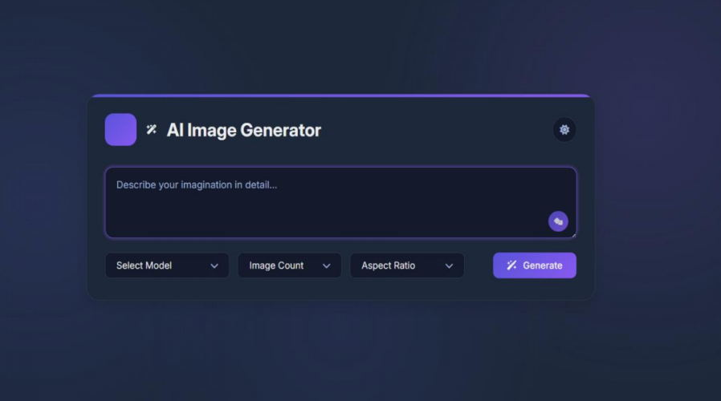
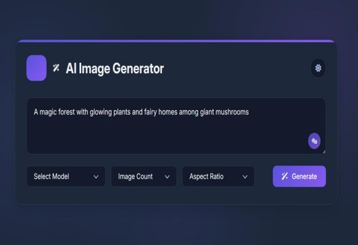
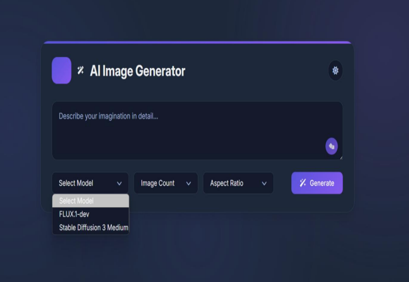
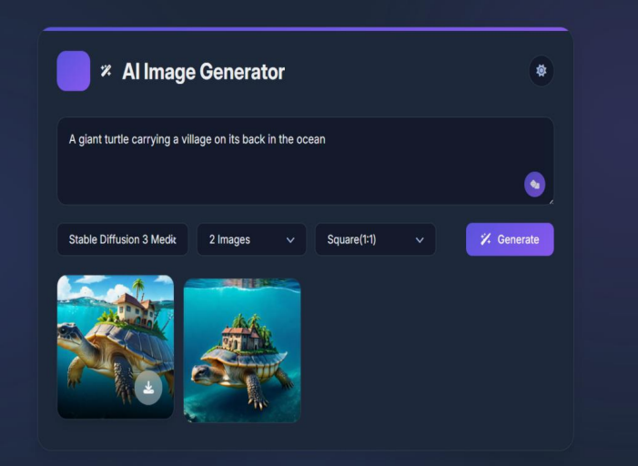
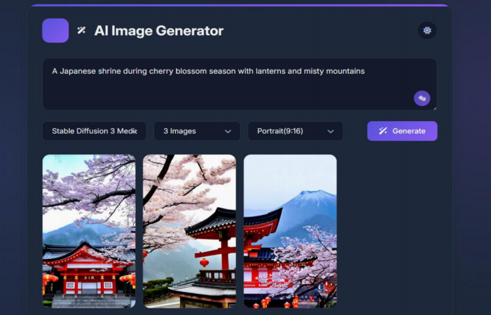
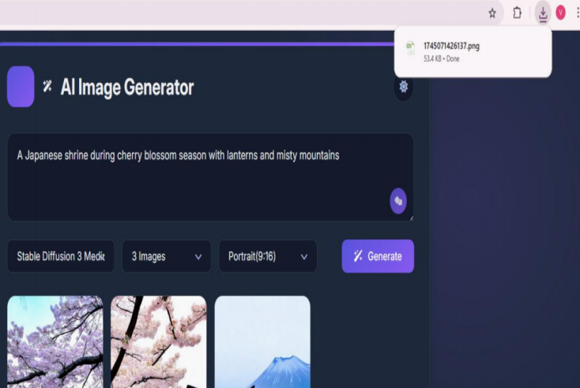

# 🎨 ImagineX – AI Text-to-Image Generator

ImagineX is an AI-powered web application that converts natural language prompts into stunning, high-quality images using advanced models like **Stable Diffusion** and **DALL·E**.
It provides a clean and intuitive interface with multiple customization options for enhanced creativity.

---

## 🚀 Application Workflow & UI

### 🌐 Home Interface

A modern and user-friendly interface where users can enter prompts and generate images.

<p align="center">
  
</p>

<p align="center">
  
</p>
---

### ✨ Prompt-Based Image Generation

Users can describe their imagination in natural language.

<p align="center">
  
</p>

---

### 🎭 Model Selection & Customization Options

Users can select different AI models like Stable Diffusion or FLUX & Users can also select image count and aspect ratio.

<p align="center">
  
</p>

---

### ⚙️ Processing & Generation

The system processes prompts and generates images in real-time.

<p align="center">
  
</p>

---

### 🖼 AI Generated Outputs 

Multiple images generated from a single prompt.

<p align="center">
  
</p>

---

### 🖼 ### 📥 Download Generated Images

Users can easily download generated images directly to their system with a single click.

<p align="center">
  
</p>

---

## 🧠 How It Works

```text
User Prompt
   ↓
AI Model (Stable Diffusion / DALL·E)
   ↓
Image Generation
   ↓
Display & Download Output
```

---

## ⚙️ Tech Stack

### 🎨 Frontend

* React.js
* Tailwind CSS
* HTML, CSS, JavaScript

### 🖥 Backend

* Node.js

### 🤖 AI Models

* OpenAI DALL·E
* Stable Diffusion
* Replicate API

---

## 🛠 Installation & Setup

### 1️⃣ Clone the Repository

```bash
git clone https://github.com/vritikavashisth/ImagineX-AI-Text-to-Image-Generator.git
cd ImagineX-AI-Text-to-Image-Generator
```

### 2️⃣ Install Dependencies

```bash
npm install
```

### 3️⃣ Setup Environment Variables

Create a `.env` file and add:

```env
OPENAI_API_KEY=your_api_key_here
```

### 4️⃣ Run the Application

```bash
npm start
```

---

## 🛣 Future Improvements

* 🔐 User authentication & prompt history
* 🖼 Image upscaling
* 🤖 Integration with more AI models
* ⚡ Performance optimization

---

## 👩‍💻 Author

**Vritika**
AI/ML Enthusiast

---
